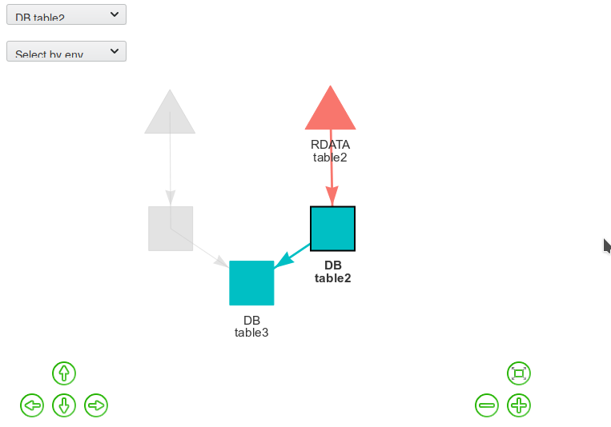
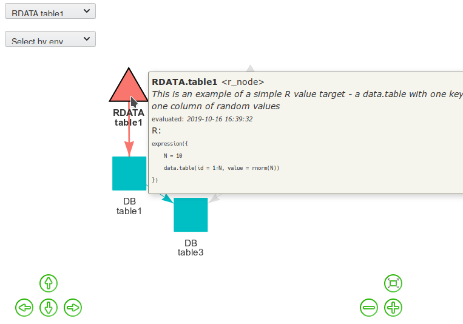

Introduction to Rflow
================
Vaclav Hausenblas
26/12/2018

``` r
library(magrittr)
library(DBI)
library(data.table)
library(Rflow)
library(RETL)
library(RETLflow)
```

## Setup environments

``` r
# R environment
.GlobalEnv[["RDATA"]] <- new.env(parent = .GlobalEnv)

# establish SQLite connection / environment
DB <-  DBI::dbConnect(RSQLite::SQLite(), ":memory:")
```

## Defining workflow

``` r
RF <- new_rflow(path = params$rflow)
```

Rflows are initiated using `new_rflow` function. The `path` argument
tells Rflow where to store cache and other necessary files.

### Creating/adding nodes

The easiest way to create a node is to define it in a list.

``` r
list(env  = "RDATA", name = "node1") %>% as_node()
#> <r_node> RDATA.node1: node1
#>   depends: 
#>   evaluated: NA
#>   changed:   
#>   triggers: 
#>     definition: FALSE
#>     manual:     FALSE
#>   cache: 
#>     enabled: FALSE
#>     exists:  
#>   expression: 
#> 
```

Every node has to have a unique id. This can be set in the definition or
it is created automatically during its initialization as a combination
of environment and name separated by dot.

The most convenient way is to define our workflow in a single named
list. Names are parsed into env + name automatically.

``` r
obj_defs <- 
  list(
    
    "RDATA.table1" =
      list(
        desc = "This is an example of a simple R value target - a data.table with one key and one column of random values",
        tags = c("table"),
        type = "r_node", # r_node is expected by default so we can ommit that when defining R nodes
        r_expr =
          expression_r({
            N = 10; 
            data.table(id = 1:N, value = rnorm(N))
          })
      ), 
    
    "DB.table1" = 
      list(
        
        tags    = c("db", "table"),
        type    = "db_node",
        depends = "RDATA.table1",
        r_expr  = 
          expression_r({
            DBI::dbWriteTable(
              conn = self$connection, 
              name = self$name, 
              value = .RFLOW[["RDATA.table1"]]$get(), 
              overwrite = TRUE
            )
          })
      ), 
    
    "DB.table2" = 
      list(
        desc    = "Shows usage of ETL tools from RETL and RETLflow packages",
        tags    = c("db", "table"),
        type    = "db_node",
        depends = "RDATA.table2",
        r_expr  = 
          expression_r({
            RETL::etl_pipe(from = self$upstream[[1]], to = self)
          })
      ), 
    
    "DB.table3" = 
      list(
        tags = c("db", "table"),
        desc = "Table is a join of ...",
        type = "db_node",
        depends = c("DB.table1", "DB.table2"),
        
        # SQL code is passed as a character value
        sql_code = c("
CREATE TABLE table3 AS
SELECT
  table1.id     AS \"id\",
  table1.value  AS value1,
  table2.value  AS value2
FROM 
  table1, table2
WHERE 
  table1.id = table2.id")
      ),

    list( # unnamed objects has to have env + name combo defined inside
      env  = "RDATA",
      name = "table2",
      tags = c("table", "R"),
      type = "r_node",
      
      # R code can be passed as a character value as well:
      r_code = "
{
  N = 20
  data.table(id = 1:N, value = rnorm(N))
}"
    )
  )
```

Nodes’ definitions can now be preprocessed and added to the workflow.

``` r
obj_defs <- process_obj_defs(obj_defs)

add_nodes(
  objs        = obj_defs,
  rflow       = RF,
  cache       = RF$.cache$path,
  verbose     = TRUE
)
#> RDATA.table1
#>   * initializing from a saved state...
#> DB.table1
#>   * initializing from a saved state...
#> DB.table2
#>   * initializing from a saved state...
#> DB.table3
#>   * initializing from a saved state...
#> RDATA.table2
#>   * initializing from a saved state...
#> RDATA.table1.RDATA.table1       DB.table1.DB.table1 
#>                      TRUE                      TRUE 
#>       DB.table2.DB.table2       DB.table3.DB.table3 
#>                      TRUE                      TRUE 
#> RDATA.table2.RDATA.table2 
#>                      TRUE
```

Rflow has tools to detect missing/unused dependencies.

``` r
which(!verify_dependencies(RF), useNames = TRUE)
#> named integer(0)
```

## Inspection

Nodes can be printed.

``` r
RF$RDATA.table1
#> <r_node> RDATA.table1: table1
#>   desc: This is an example of a simple R value target - a data.table with one key and one column of random values
#>   tags: table
#>   depends: 
#>   evaluated: 2019-10-16 16:39:32
#>   changed:   2019-10-16 16:39:32
#>   triggers: 
#>     definition: FALSE
#>     manual:     FALSE
#>   cache: 
#>     enabled: TRUE
#>     exists:  TRUE
#>   expression: 
#>     expression({
#>         N = 10
#>         data.table(id = 1:N, value = rnorm(N))
#>     })
```

## Visualisation

Workflows can be visualized in an interactive html widget.

``` r
visRflow(RF, includeIsolated = FALSE)
```

*Note: HTML widget cannot be diplayed on github. Screenshots:*




## Making/building the targets

We have multiple ways how to specify, which targets should be made.

We can select all of them:

``` r
make(RF)
#> ─── Make ─────────────────────────
#> 
#> ┌ Solving node DB.table3
#> │  ┌ Solving node DB.table1
#> │  │  ┌ Solving node RDATA.table1
#> │  │  └ RDATA.table1 not triggered.
#> │  └ DB.table1 triggered by missing target/value
#> │  │    DB.table1: the target does not exist!
#> │  │    DB.table1: Evaluating R expression:
#> │  │    expression({
#> │  │        DBI::dbWriteTable(conn = self$connection, name = self$name, 
#> │  │            value = .RFLOW[["RDATA.table1"]]$get(), overwrite = TRUE)
#> │  │    })
#> │  ┌ Solving node DB.table2
#> │  │  ┌ Solving node RDATA.table2
#> │  │  └ RDATA.table2 not triggered.
#> │  └ DB.table2 triggered by missing target/value
#> │  │    DB.table2: the target does not exist!
#> │  │    DB.table2: Evaluating R expression:
#> │  │    expression({
#> │  │        RETL::etl_pipe(from = self$upstream[[1]], to = self)
#> │  │    })
#> └ DB.table3 triggered by changes in upstream nodes (DB.table1, DB.table2)
#> │    DB.table3: the target does not exist!
#> │    DB.table3: Evaluating SQL statements:
#> │      
#> │      CREATE TABLE table3 AS
#> │      SELECT
#> │        table1.id     AS "id",
#> │        table1.value  AS value1,
#> │        table2.value  AS value2
#> │      FROM 
#> │        table1, table2
#> │      WHERE 
#> │        table1.id = table2.id
```

Or choose them by tags:

``` r
make(RF, tags = "db")
#> ─── Make ─────────────────────────
#> 
#> ┌ Solving node DB.table3
#> │  ┌ Solving node DB.table1
#> │  │  ┌ Solving node RDATA.table1
#> │  │  └ RDATA.table1 not triggered.
#> │  └ DB.table1 not triggered.
#> │  ┌ Solving node DB.table2
#> │  │  ┌ Solving node RDATA.table2
#> │  │  └ RDATA.table2 not triggered.
#> │  └ DB.table2 not triggered.
#> └ DB.table3 not triggered.
```

Or choose one specific node

``` r
make(RF$DB.table1) # equivalent to RF$DB.table1$make()
#> ┌ Solving node DB.table1
#> │  ┌ Solving node RDATA.table1
#> │  └ RDATA.table1 not triggered.
#> └ DB.table1 not triggered.
```

## Tests

``` r
DBI::dbReadTable(DB, "table1")
#>    id      value
#> 1   1 -0.9168230
#> 2   2  0.9503448
#> 3   3  2.1644968
#> 4   4 -0.9618563
#> 5   5  0.7938722
#> 6   6 -1.6381032
#> 7   7 -0.1420323
#> 8   8 -0.9192612
#> 9   9 -0.3486626
#> 10 10 -0.2038369
DBI::dbReadTable(DB, "table2")
#>    id       value
#> 1   1 -1.48538381
#> 2   2 -0.55467738
#> 3   3 -0.09214937
#> 4   4 -0.25299202
#> 5   5 -1.22896735
#> 6   6 -1.35159238
#> 7   7 -0.99955918
#> 8   8 -0.31847317
#> 9   9 -1.65509340
#> 10 10 -1.34724789
#> 11 11 -0.57043211
#> 12 12 -0.35195760
#> 13 13 -2.21594531
#> 14 14 -0.74729647
#> 15 15 -0.80242952
#> 16 16 -0.76448857
#> 17 17 -0.29137025
#> 18 18  0.87733433
#> 19 19 -0.16743281
#> 20 20  1.57417001
DBI::dbReadTable(DB, "table3")
#>    id     value1      value2
#> 1   1 -0.9168230 -1.48538381
#> 2   2  0.9503448 -0.55467738
#> 3   3  2.1644968 -0.09214937
#> 4   4 -0.9618563 -0.25299202
#> 5   5  0.7938722 -1.22896735
#> 6   6 -1.6381032 -1.35159238
#> 7   7 -0.1420323 -0.99955918
#> 8   8 -0.9192612 -0.31847317
#> 9   9 -0.3486626 -1.65509340
#> 10 10 -0.2038369 -1.34724789
```

# Cleanup

``` r
DBI::dbDisconnect(DB)
```
